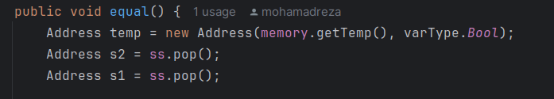
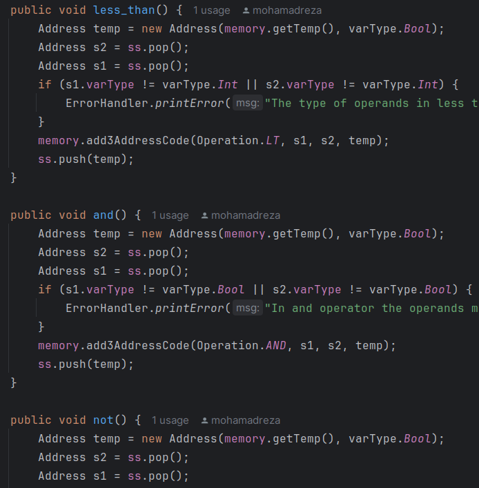
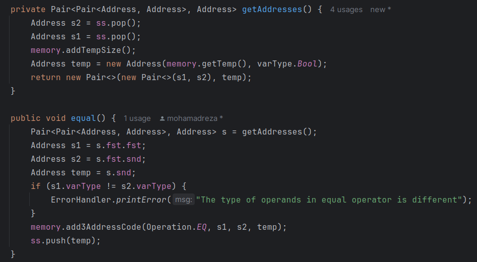
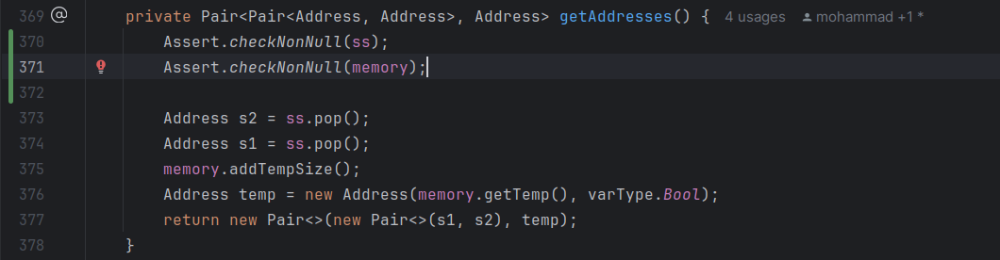

# Experiment 6


# Rules of MiniJava
```
Goal --> Source EOF
Source --> ClassDeclarations MainClass
MainClass --> class Identifier { public static void main() { VarDeclarations Statements}}
ClassDeclarations --> ClassDeclaration ClassDeclarations | lambda
ClassDeclaration --> class Identifier Extension { FieldDeclarations MethodDeclarations }
Extension --> extends Identifier | lambda
FieldDeclarations --> FieldDeclaration FieldDeclarations | lambda
FieldDeclaration --> static Type Identifier ;
VarDeclarations --> VarDeclaration VarDeclarations | lambda
VarDeclaration --> Type Identifier ;
MethodDeclarations --> MethodDeclaration MethodDeclarations | lambda
MethodDeclaration --> public static Type Identifier ( Parameters ) { VarDeclarations Statements return GenExpression ; }
Parameters --> Type Identifier Parameter | lambda
Parameter --> , Type Identifier Parameter | lambda
Type --> boolean | int
Statements --> Statements Statement | lambda
Statement --> { Statements } | if ( GenExpression ) Statement else Statement | while ( GenExpression ) Statement | System.out.println ( GenExpression ) ; | Identifier = GenExpression ;
GenExpression --> Expression | RelExpression
Expression --> Expression + Term | Expression - Term | Term
Term --> Term * Factor | Factor
Factor --> ( Expression ) | Identifier | Identifier . Identifier | Identifier . Identifier ( Arguments ) | true | false | Integer
RelExpression --> RelExpression && RelTerm | RelTerm
RelTerm --> Expression == Expression | Expression < Expression
Arguments --> GenExpression Argument | lambda
Argument --> , GenExpression Argument | lambda
Identifier --> <IDENTIFIER_LITERAL>
Integer --> <INTEGER_LITERAL>
```

## فاز اول 
- در این بخش از آزمایش سعی کردیم تا خواسته های گفته شده در بخش اول را به وسیله ی دو الگوی state و strategy پیاده سازی کنیم. در زیر تحقق هر کدام را به صورت جداگانه توضیح میدهیم.

### State Pattern
در بخش اول میدانیم که مسیر های بین شهر ها میتواند دوطرفه و یا یک طرفه باشد که در منوی اولیه میتوان آن را تغییر داد. پس در حالت کلی سیستم مسیر های ما دو حالت مختلف دارد. اجزای پیاده سازی الگوی state شامل موارد زیر می باشد که در هریک تصویر کلاس مربوطه را آورده ایم : 
- Context : 
    - این کلاس مسئولیت اصلی را بر عهده دارد و متد هایی برای تغییر وضعیت ها دارد.
    - 
- State Interface: 
    - این کلاس یک اینترفیس است که تمام وضعیت ها باید از آن ارث بری کنند.
    - 
- Concrete State: 
    - این کلاس ها وضعیت های مختلف را پیاده سازی میکنند. هریک از این کلاس ها نشان دهنده ی یکی از حالات مختلف راه ها می باشد که بسته به نوع راه تغییراتی در مسیر های موجود باید ایجاد کرد که تابع `changeRoads` در هرکدام به صورت متفاوتی پیاده سازی میشود. به محض تغییر حالت در Context این تابع نیز صدا زده میشود.
    - 
    - 

در قسمت Context یک متغییری به نام State داریم که به اینترفیس State Interface متصل میشود و به راحتی بدون هیچ مشکلی میتوانیم حالت ها و تغییرات خاص هر حالت را با این واسط اعمال کنیم و تغییر حالت بدهیم. با این کار میتوان صدها حالت نیز تعریف کرد و هر یک ویژگی ها و رفتار های خاص خود را داشته باشد.

### Strategy Pattern
در بخش دوم میدانیم که حرکت ما در این مسیر ها میتواند بوسیله ی قطار یا اتوبوس صورت گیرد پس یک مسئله ای داریم که دارای دو راه حل می باشد و بایستی از الگوی strategy در این قسمت استفاده کنیم. الگوی strategy اجزای زیر را دارد که در ادامه تصویر مربوط به آن و توضیحات آن را آورده ایم : 
- Context : 
    - این کلاس مسئولیت اصلی را بر عهده دارد و در آن میتوان الگوریتم موردنظر را ست کرد و خواسته ی مورد نظر را از آن گرفت که با توجه به نوع الگوریتم پیاده سازی های متفاوتی خواهد داشت.
    - 

- Strategy Interface : 
  - این کلاس یک اینترفیس است که تمام استراتژی ها باید از آن ارث بری کنند. و کلاس context به واسطه این با تمامی الگوریتم ها در ارتباط است.
  - 

- Concrete Strategy :
  - این کلاس ها الگوریتم های مختلف را پیاده سازی میکنند. هریک از این کلاس ها نشان دهنده ی یکی از الگوریتم های مختلف حرکت می باشد که بسته به نوع حرکت تغییراتی در حرکت باید ایجاد کرد که تابع `calculateTime` در هرکدام به صورت متفاوتی پیاده سازی میشود. پس از انتخاب الگوریتم مورد نظر توسط client در context این تابع صدا زده شده و زمان را اعلام میکند.
  - 
  - 

- Client :
  - این کلاس مسئول انتخاب الگوریتم مورد نظر است و با توجه به نیاز خود الگوریتم مورد نظر را انتخاب میکند و در context ست میکند. کلاینت در کد ما در کلاس Main در بخش انتخاب ها وجود دارد.
  - 
  
در اینجا بدون نیاز به جمله ی شرطی توانسیم زمان موردنیاز برای انتقال را بر اساس نوع استراتژی انتخاب و محاسبه کنیم. در این قسمت فاز اول آزمایش به پایان می رسد.


## فاز دوم

### Facades :


### strategy :

در مرحله دوم مشاهده کردیم که از TypeAddress به عنوان enum استفاده شده که در کلاس address به عنوان ورودی گرفته می شود و در نهایت با توجه به تایپ آدرس یک خروجی استرینگ داده می شود. 

از آنجایی که این مورد باعث پیچیده تر شدن کد شده بود TypeAddress را به یک Interface تبدیل کردیم و در آن متدی تحت عنوان toString تعریف کردیم. در ادامه باقی حالات enum را به عنوان کلاس های مختلف تبدیل کردیم تا خروجی مورد نظر را تحویل دهد. این کار حجم و پیچیدگی کد را کاهش می دهد و باعث می شود که دیگر نیازی به یک فرایند چند مرحله ای برای بدست آوردن آدرس نشویم. همچنین اگر برای آدرس دهی ها نیاز باشد که تابع های دیگری به این کلاس ها اضافه کنیم می توانیم آن ها را ساده تر پیاده سازی کنیم .  switch که در کلاس address استفاده شده بود هم از بین می رود و دیگر نیازی به برسی یک مرحله اضافه تر نخواهد بود و در لحظه ای که آدرس را می خواهیم با فراخوانی این توابع از کلاسهایشان می توانیم به آدرس مورد نظر برسیم. 

این موارد نمونه ای از استفاده strategy را نشان می دهند. 

### TypeAddress Interface : 


### Other Enum states : 
#### Direct


#### Imidiate


#### Indirect


و در نهایت کلاس ها به این صورت شد :‌


قرمز بودن Imidiate به خاطر گیتهاب است


#### Extract Repeated Pattern





#### Add Assertion




## سوالات 

### 1. در کتاب GoF سه دسته الگوی طراحی معرفی شده است. آن‌ها را نام ببرید و در مورد هر دسته در حد دو خط توضیح دهید.

الگوهای سازنده (Creational Patterns):
این الگوها به فرآیند ایجاد اشیاء تمرکز دارند و به توسعه‌دهندگان کمک می‌کنند تا بدون وابستگی به کلاس‌های خاص، اشیاء را ایجاد کنند.

الگوهای ساختاری (Structural Patterns):
این الگوها به ترکیب کلاس‌ها و اشیاء در ساختارهای بزرگتر می‌پردازند و به چگونگی سازماندهی و ترکیب کلاس‌ها و اشیاء برای ایجاد سیستم‌های پیچیده‌تر کمک می‌کنند.

الگوهای رفتاری (Behavioral Patterns):
این الگوها به تعاملات و مسئولیت‌های بین اشیاء در سیستم می‌پردازند و الگوهایی برای چگونگی ارتباط و همکاری اشیاء مختلف در انجام وظایف ارائه می‌دهند.

### 2. الگوهای استفاده شده در فاز اول آزمایش  جزو کدام دسته هستند؟
الگو های استفاده شده strategy و state بودند که طبق محتوای سایت ها و سورس های داده شده در بخش رفتاری قرار می گیرند. چون دقیقا به چگونگی ارتباط کلاس ها و شی های آن ها مربوط می شوند.

### 3. با توجه به این که در فاز اول در هر زمان درخواست دقیقا در یکی از دو حالت یک طرفه و یا دو طرفه هستیم کدام الگوی طراحی را برای پاسخ دادن به سوال کاربران مناسب می‌دانید؟ ضمن بیان علت انتخاب خود، نحوه تحقق الگو را به طور کامل توضیح دهید.

درباره این مورد از state استفاده کردیم چون در استفاده از حالات مختلف کار ما را راحت می کند. در قسمت فاز یک توضیح این مورد را به صورت کامل دادیم
### 4. تحقق و یا عدم تحقق هر کدام از اصول SOLID را در خصوص الگوی طراحی Singleton بیان کنید (هرکدام حداکثر در سه خط).

الگوی طراحی Singleton با اصول SOLID به صورت زیر تعامل دارد:

اصل مسئولیت واحد (SRP):
الگوی Singleton این اصل را نقض می‌کند زیرا علاوه بر مدیریت ایجاد یک نمونه، مسئولیت مدیریت چرخه حیات شیء و دسترسی به آن را نیز بر عهده دارد، که منجر به تراکم وظایف در یک کلاس می‌شود.

اصل باز/بسته (OCP):
Singleton با این اصل مشکل دارد، زیرا معمولاً تغییرات در کلاس Singleton نیاز به تغییر مستقیم آن دارد و امکان گسترش بدون تغییر در کلاس پایه محدود است.

اصل جایگزینی لیسکوف (LSP):
الگوی Singleton به طور مستقیم با این اصل مشکل ندارد، اما اگر کلاس Singleton از یک کلاس پایه ارث‌بری کند، حفظ این اصل ممکن است پیچیده‌تر شود.

اصل جداسازی رابط (ISP):
Singleton به‌طور مستقیم این اصل را نقض نمی‌کند، اما اگر وظایف متعددی به کلاس Singleton اضافه شود، می‌تواند به نقض این اصل منجر شود.

اصل وارونگی وابستگی (DIP):
Singleton معمولاً این اصل را نقض می‌کند زیرا کلاس‌ها را به یک پیاده‌سازی خاص وابسته می‌کند و امکان استفاده از وابستگی‌های مختلف را محدود می‌سازد.

### 5. هر یک از مفاهیم زیر را در حد یک خط توضیح دهید.
کد تمیز: کدی که ساده، قابل‌فهم، و قابل نگهداری باشد و توسعه‌دهندگان بتوانند به راحتی آن را بخوانند و تغییر دهند.

بدهی فنی: زمانی که تصمیمات سریع و ناکارآمد در توسعه کد گرفته می‌شود که نیاز به بازنگری و بهبود دارد.

بوی بد: نشانه‌های مشکل‌ساز در کد که نشان‌دهنده نیاز به بازآرایی (refactoring) برای بهبود کیفیت و نگهداری کد است.

### 6. طبق دسته‌بندی وب‌سایت refactoring.guru، بوهای بد کد به پنج دسته تقسیم می‌شوند. در مورد هر کدام از این پنج دسته توضیح مختصری دهید.

کدهای حجیم (Bloaters):
این دسته شامل مشکلاتی است که نشان می‌دهد کد شما بیش از حد بزرگ یا پیچیده است. مثال‌هایی از این مشکلات شامل متدهای طولانی، کلاس‌های بزرگ، و لیست‌های پارامتر طولانی است. این نوع کدها نگهداری و درک آن‌ها را دشوار می‌کند.

سوءاستفاده از اصول شیءگرایی (Object-Orientation Abusers):
این دسته به مشکلاتی اشاره دارد که در استفاده نادرست از اصول طراحی شیءگرایی رخ می‌دهد، مانند ساختارهای وراثتی نامناسب یا کپسوله‌سازی ضعیف.

مانع‌های تغییر (Change Preventers):
این بوها کدهایی را توصیف می‌کنند که تغییر آن‌ها سخت است. مثال‌هایی شامل وابستگی زیاد بین کلاس‌ها یا مواردی که تغییر در یک بخش از سیستم منجر به تغییرات گسترده در بخش‌های دیگر می‌شود.

موارد غیرضروری (Dispensables):
این دسته شامل کدهایی است که می‌توان بدون مشکل از آن‌ها صرف‌نظر کرد. مثال‌هایی از این مشکلات شامل کدهای تکراری، کدهای بدون استفاده، و کلاس‌هایی است که فقط داده‌ها را نگه می‌دارند بدون اینکه عملکرد خاصی داشته باشند.

وابستگی‌ها (Couplers):
این بوها به وابستگی‌های بیش از حد بین کلاس‌ها اشاره دارند که باعث می‌شود کلاس‌ها بیش از حد به یکدیگر متکی باشند. مثال‌هایی شامل استفاده بیش از حد یک کلاس از متدهای کلاس دیگر و صمیمیت نامناسب بین کلاس‌ها است.

### 7. یکی از انواع بوهای بد، Lazy Class است.
#### این بوی بد در کدام یک از دسته‌بندی‌های پنج‌گانه قرار می‌گیرد؟
#### برای برطرف‌کردن این بو، استفاده از کدام بازآرایی‌ها پیشنهاد می‌شود؟
#### در چه مواقعی باید این بو را نادیده گرفت؟

کلاس تنبل (Lazy Class) یکی از بوهای بد کد است که در دسته‌بندی موارد غیرضروری (Dispensables) قرار می‌گیرد. این بو زمانی ایجاد می‌شود که یک کلاس مسئولیت‌های کمی دارد و به اندازه کافی مفید نیست یا به مرور زمان وظایف خود را از دست داده است.
برای برطرف کردن این بو، می‌توان از بازآرایی‌های زیر استفاده کرد:

‏Inline Class: در صورتی که کلاس بسیار کوچک شده است و دیگر وجودش منطقی نیست، می‌توانید عملکرد آن را در کلاسی دیگر ادغام کنید.
Collapse Hierarchy: اگر کلاس Lazy بخشی از یک سلسله‌مراتب ارث‌بری است، ممکن است با ادغام آن با کلاس‌های والد یا فرزند، سلسله‌مراتب را ساده‌تر کنید.

‏مواقعی که باید این بو را نادیده گرفت:

‏اگر انتظار می‌رود که کلاس در آینده نزدیک وظایف بیشتری به عهده بگیرد.
اگر این کلاس بخشی از یک ساختار کلی است که کمک می‌کند هماهنگی و یکپارچگی در کد حفظ شود، حتی اگر در حال حاضر به‌طور کامل استفاده نمی‌شود.

طبق دسته بندی خود سایت این مورد در Dispensables قرار می گیرد.

### 8. در وبسایت 29 بوی بد کد نامبرده شده است. سعی کنید 10 بوی بد را در پروژه تبدیل کننده مدل به سی پیدا کنید و به آن اشاره کنید.

#### در سایت ۲۳ مورد وجود داشت نه ۲۹ مورد که به صورت زیر لیست کردیم :‌


کدهای حجیم (Bloaters):

متد طولانی (Long Method): متدهایی که بیش از حد طولانی هستند و وظایف متعددی انجام می‌دهند، به‌سختی قابل درک و نگهداری هستند.

کلاس بزرگ (Large Class): کلاس‌هایی که مسئولیت‌های زیادی دارند و بیش از حد بزرگ شده‌اند، معمولاً از اصل مسئولیت یکتا سرپیچی می‌کنند.

وسواس اولیه (Primitive Obsession): استفاده بیش از حد از داده‌های ابتدایی به جای اشیاء خاص که باعث پیچیدگی در کد می‌شود.

لیست پارامتر طولانی (Long Parameter List): متدهایی که تعداد زیادی پارامتر می‌پذیرند، معمولاً نشانه‌ای از طراحی ضعیف هستند.

توده‌های داده (Data Clumps): تکرار مکرر گروه‌های داده‌ای مشابه در متدها و کلاس‌های مختلف که باید در یک شیء واحد قرار گیرند.

سوءاستفاده از اصول شی‌گرایی (Object-Orientation Abusers):

عبارات سوئیچ (Switch Statements): استفاده زیاد از عبارات switch به‌جای استفاده از چندریختی (Polymorphism)، باعث کد ضعیف و غیرقابل نگهداری می‌شود.

فیلد موقتی (Temporary Field): فیلدهایی که تنها در برخی از شرایط خاص استفاده می‌شوند و معمولاً نیاز به بازآرایی دارند.

ارث بری رد شده (Refused Bequest): زمانی که یک کلاس فرزند تمایلی به استفاده از عملکردهای ارث‌بری شده از کلاس والد ندارد، معمولاً به معنای نیاز به طراحی مجدد است.

کلاس‌های جایگزین با رابط‌های مختلف (Alternative Classes with Different Interfaces): کلاس‌هایی که عملکرد مشابه دارند اما از رابط‌های مختلفی استفاده می‌کنند و ممکن است نیاز به یکپارچه‌سازی داشته باشند.

مانع‌های تغییر (Change Preventers):

تغییرات واگرا (Divergent Change): زمانی که یک کلاس برای دلایل متفاوت به‌طور مکرر تغییر می‌کند، نشان‌دهنده نیاز به تقسیم وظایف است.

جراحی شاتگان (Shotgun Surgery): تغییرات کوچک در یک قسمت از کد نیازمند تغییرات متعدد در قسمت‌های دیگر است، که نشانه وابستگی زیاد بین اجزای سیستم است.

سلسله‌مراتب وراثتی موازی (Parallel Inheritance Hierarchies): زمانی که هر بار یک کلاس جدید در یک سلسله‌مراتب ارث‌بری ایجاد می‌شود، باید یک کلاس مشابه در سلسله‌مراتب دیگری نیز ایجاد شود، که نشان‌دهنده طراحی ضعیف است.

موارد غیرضروری (Dispensables):

توضیحات غیرضروری (Comments): توضیحات غیرضروری که نشان‌دهنده این است که کد به اندازه کافی واضح نیست و نیاز به بهبود دارد.

کد تکراری (Duplicate Code): کدهای تکراری که باید حذف یا به متدها و کلاس‌های مجزا تبدیل شوند.

کلاس تنبل (Lazy Class): کلاس‌هایی که وظایف کمی دارند و نیاز به ادغام با کلاس‌های دیگر یا حذف دارند.

کلاس داده (Data Class): کلاس‌هایی که فقط داده‌ها را نگه می‌دارند و هیچ عملکردی ندارند، باید بهبود یابند.

کد مرده (Dead Code): کدهایی که دیگر استفاده نمی‌شوند و باید حذف شوند.

عمومیت نظری (Speculative Generality): کدی که برای آینده احتمالی نوشته شده اما هیچ کاربرد فعلی ندارد و باید حذف شود.

وابستگی‌ها (Couplers):

حسادت به ویژگی (Feature Envy): زمانی که یک کلاس بیش از حد از داده‌های کلاس دیگری استفاده می‌کند، نشانه وابستگی زیاد است.

صمیمیت نامناسب (Inappropriate Intimacy): کلاس‌هایی که بیش از حد به جزئیات پیاده‌سازی کلاس‌های دیگر دسترسی دارند و باید بهبود یابند.

زنجیره‌های پیام (Message Chains): زنجیره طولانی از فراخوانی متدها که نشان‌دهنده وابستگی زیاد بین اشیاء است.

واسطه‌گر (Middle Man): کلاس‌هایی که تمام وظایف خود را به کلاس‌های دیگر واگذار می‌کنند و عملاً کاری انجام نمی‌دهند، باید حذف شوند.

بوهای بد دیگر (Other Smells):

کلاس کتابخانه‌ای ناقص (Incomplete Library Class): کلاس‌هایی که به نظر می‌رسد ناتمام هستند و تمام قابلیت‌های مورد نیاز را ارائه نمی‌دهند، و نیاز به تکمیل دارند.


### 9. در انتها بگویید پلاگین formatter چه می کند و چرا می تواند کمک کننده باشد و رابطه آن با باز آرایی کد چیست؟

پلاگین formatter ابزاری است که کد شما را بر اساس قواعد و استانداردهای مشخصی قالب‌بندی می‌کند. این ابزار به‌طور خودکار فاصله‌ها، تورفتگی‌ها، محل قرارگیری پرانتزها و سایر عناصر ساختاری کد را تنظیم می‌کند.
چرا مفید است:

خوانایی بهتر: کد تمیزتر و منسجم‌تر می‌شود و توسعه‌دهندگان دیگر به‌راحتی آن را درک می‌کنند.
کاهش اشتباهات: جلوگیری از بروز خطاهای ناشی از فرمت نادرست کد.
سازگاری تیمی: همه اعضای تیم از یک استاندارد واحد برای نوشتن کد استفاده می‌کنند.

رابطه با بازآرایی کد:

 اغلب اولین گام برای بهبود ساختار کد Formatter
  است، و بازآرایی‌ها بعد از  آن انجام می شوند تا منطق کد بهبود یابد و بوهای بد برطرف شوند.
