# Experiment 6


# Rules of MiniJava
```
Goal --> Source EOF
Source --> ClassDeclarations MainClass
MainClass --> class Identifier { public static void main() { VarDeclarations Statements}}
ClassDeclarations --> ClassDeclaration ClassDeclarations | lambda
ClassDeclaration --> class Identifier Extension { FieldDeclarations MethodDeclarations }
Extension --> extends Identifier | lambda
FieldDeclarations --> FieldDeclaration FieldDeclarations | lambda
FieldDeclaration --> static Type Identifier ;
VarDeclarations --> VarDeclaration VarDeclarations | lambda
VarDeclaration --> Type Identifier ;
MethodDeclarations --> MethodDeclaration MethodDeclarations | lambda
MethodDeclaration --> public static Type Identifier ( Parameters ) { VarDeclarations Statements return GenExpression ; }
Parameters --> Type Identifier Parameter | lambda
Parameter --> , Type Identifier Parameter | lambda
Type --> boolean | int
Statements --> Statements Statement | lambda
Statement --> { Statements } | if ( GenExpression ) Statement else Statement | while ( GenExpression ) Statement | System.out.println ( GenExpression ) ; | Identifier = GenExpression ;
GenExpression --> Expression | RelExpression
Expression --> Expression + Term | Expression - Term | Term
Term --> Term * Factor | Factor
Factor --> ( Expression ) | Identifier | Identifier . Identifier | Identifier . Identifier ( Arguments ) | true | false | Integer
RelExpression --> RelExpression && RelTerm | RelTerm
RelTerm --> Expression == Expression | Expression < Expression
Arguments --> GenExpression Argument | lambda
Argument --> , GenExpression Argument | lambda
Identifier --> <IDENTIFIER_LITERAL>
Integer --> <INTEGER_LITERAL>
```

## فاز اول 
- در این بخش از آزمایش سعی کردیم تا خواسته های گفته شده در بخش اول را به وسیله ی دو الگوی state و strategy پیاده سازی کنیم. در زیر تحقق هر کدام را به صورت جداگانه توضیح میدهیم.

### State Pattern
در بخش اول میدانیم که مسیر های بین شهر ها میتواند دوطرفه و یا یک طرفه باشد که در منوی اولیه میتوان آن را تغییر داد. پس در حالت کلی سیستم مسیر های ما دو حالت مختلف دارد. اجزای پیاده سازی الگوی state شامل موارد زیر می باشد که در هریک تصویر کلاس مربوطه را آورده ایم : 
- Context : 
    - این کلاس مسئولیت اصلی را بر عهده دارد و متد هایی برای تغییر وضعیت ها دارد.
    - 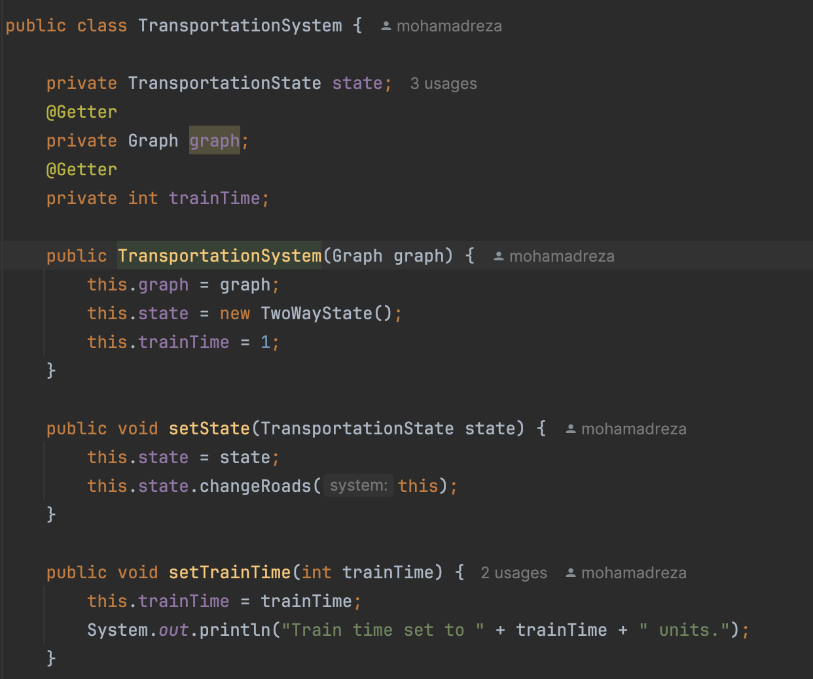
- State Interface: 
    - این کلاس یک اینترفیس است که تمام وضعیت ها باید از آن ارث بری کنند.
    - 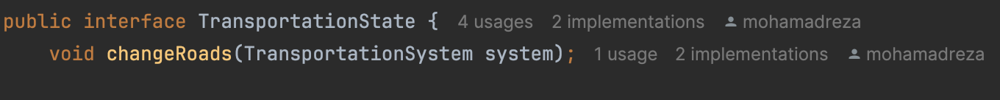
- Concrete State: 
    - این کلاس ها وضعیت های مختلف را پیاده سازی میکنند. هریک از این کلاس ها نشان دهنده ی یکی از حالات مختلف راه ها می باشد که بسته به نوع راه تغییراتی در مسیر های موجود باید ایجاد کرد که تابع `changeRoads` در هرکدام به صورت متفاوتی پیاده سازی میشود. به محض تغییر حالت در Context این تابع نیز صدا زده میشود.
    - 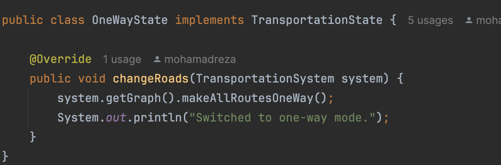
    - 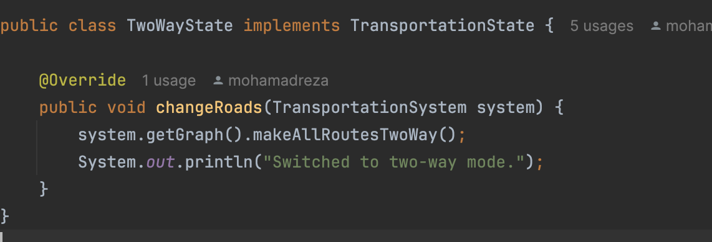

در قسمت Context یک متغییری به نام State داریم که به اینترفیس State Interface متصل میشود و به راحتی بدون هیچ مشکلی میتوانیم حالت ها و تغییرات خاص هر حالت را با این واسط اعمال کنیم و تغییر حالت بدهیم. با این کار میتوان صدها حالت نیز تعریف کرد و هر یک ویژگی ها و رفتار های خاص خود را داشته باشد.

### Strategy Pattern
در بخش دوم میدانیم که حرکت ما در این مسیر ها میتواند بوسیله ی قطار یا اتوبوس صورت گیرد پس یک مسئله ای داریم که دارای دو راه حل می باشد و بایستی از الگوی strategy در این قسمت استفاده کنیم. الگوی strategy اجزای زیر را دارد که در ادامه تصویر مربوط به آن و توضیحات آن را آورده ایم : 
- Context : 
    - این کلاس مسئولیت اصلی را بر عهده دارد و در آن میتوان الگوریتم موردنظر را ست کرد و خواسته ی مورد نظر را از آن گرفت که با توجه به نوع الگوریتم پیاده سازی های متفاوتی خواهد داشت.
    - 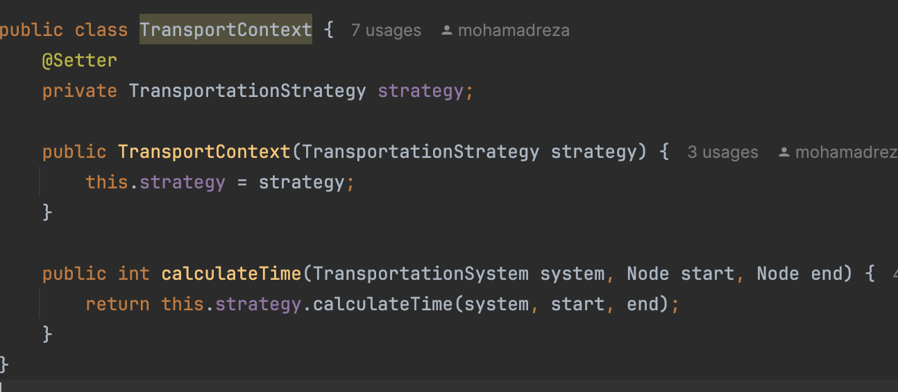

- Strategy Interface : 
  - این کلاس یک اینترفیس است که تمام استراتژی ها باید از آن ارث بری کنند. و کلاس context به واسطه این با تمامی الگوریتم ها در ارتباط است.
  - 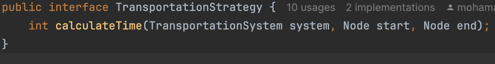

- Concrete Strategy :
  - این کلاس ها الگوریتم های مختلف را پیاده سازی میکنند. هریک از این کلاس ها نشان دهنده ی یکی از الگوریتم های مختلف حرکت می باشد که بسته به نوع حرکت تغییراتی در حرکت باید ایجاد کرد که تابع `calculateTime` در هرکدام به صورت متفاوتی پیاده سازی میشود. پس از انتخاب الگوریتم مورد نظر توسط client در context این تابع صدا زده شده و زمان را اعلام میکند.
  - 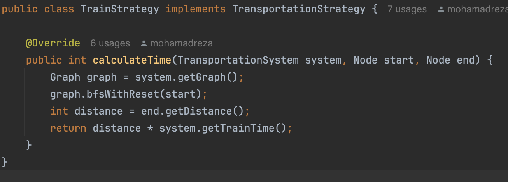
  - 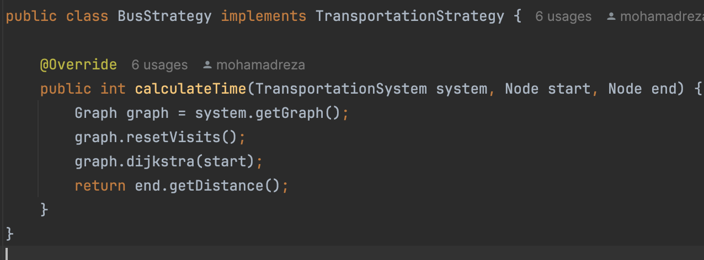

- Client :
  - این کلاس مسئول انتخاب الگوریتم مورد نظر است و با توجه به نیاز خود الگوریتم مورد نظر را انتخاب میکند و در context ست میکند. کلاینت در کد ما در کلاس Main در بخش انتخاب ها وجود دارد.
  - 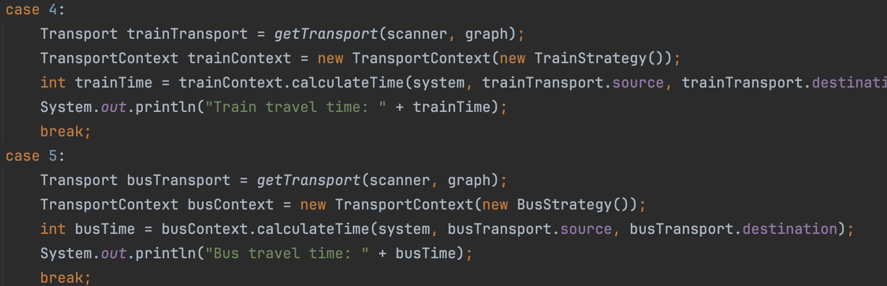
  
در اینجا بدون نیاز به جمله ی شرطی توانسیم زمان موردنیاز برای انتقال را بر اساس نوع استراتژی انتخاب و محاسبه کنیم. در این قسمت فاز اول آزمایش به پایان می رسد.

## فاز دوم

### Facades :
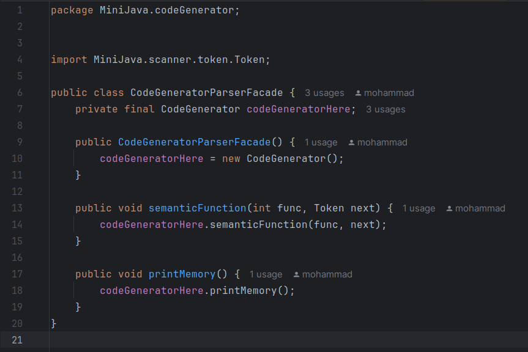


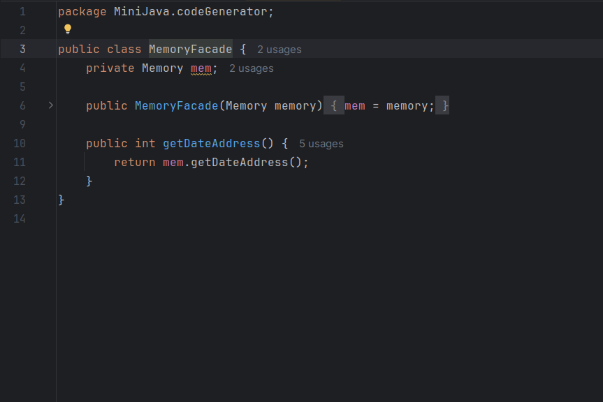

### strategy :

در مرحله دوم مشاهده کردیم که از TypeAddress به عنوان enum استفاده شده که در کلاس address به عنوان ورودی گرفته می شود و در نهایت با توجه به تایپ آدرس یک خروجی استرینگ داده می شود. 

از آنجایی که این مورد باعث پیچیده تر شدن کد شده بود TypeAddress را به یک Interface تبدیل کردیم و در آن متدی تحت عنوان toString تعریف کردیم. در ادامه باقی حالات enum را به عنوان کلاس های مختلف تبدیل کردیم تا خروجی مورد نظر را تحویل دهد. این کار حجم و پیچیدگی کد را کاهش می دهد و باعث می شود که دیگر نیازی به یک فرایند چند مرحله ای برای بدست آوردن آدرس نشویم. همچنین اگر برای آدرس دهی ها نیاز باشد که تابع های دیگری به این کلاس ها اضافه کنیم می توانیم آن ها را ساده تر پیاده سازی کنیم .  switch که در کلاس address استفاده شده بود هم از بین می رود و دیگر نیازی به برسی یک مرحله اضافه تر نخواهد بود و در لحظه ای که آدرس را می خواهیم با فراخوانی این توابع از کلاسهایشان می توانیم به آدرس مورد نظر برسیم. 

این موارد نمونه ای از استفاده strategy را نشان می دهند. 

### TypeAddress Interface : 


### Other Enum states : 
#### Direct


#### Imidiate


#### Indirect


و در نهایت کلاس ها به این صورت شد :‌


قرمز بودن Imidiate به خاطر گیتهاب است

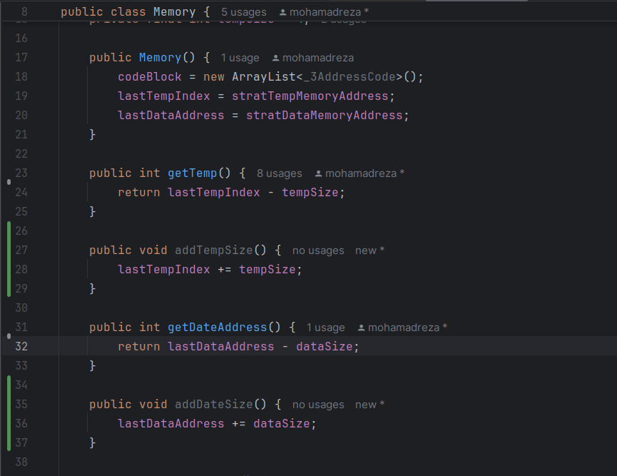

